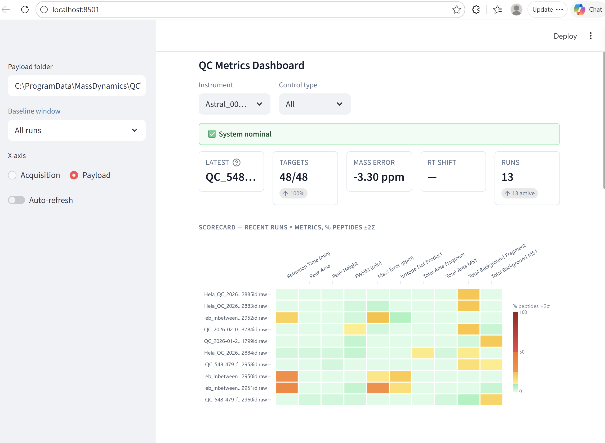

# MD QC Agent

[](https://github.com/webwebb56/mdqc-py/releases/latest)
[](./LICENSE)

**Automated quality-control monitoring for mass-spectrometry instruments.**

A small background service that watches your acquisition folder, runs targeted
Skyline extractions on every new raw file, and surfaces the results in a
single-page Levey-Jennings dashboard — designed for operators who want to spot
chromatography drift, calibration shifts, and sample-prep issues *before* they
contaminate weeks of data.

Built by [Mass Dynamics](https://massdynamics.com). MIT-licensed.


*Single-page dashboard: status banner, KPI tiles, and a per-run × per-metric
scorecard heatmap that turns 48 peptides × 11 metrics into one glanceable
view.*

---

## What it does

- **Watches** any folder containing `.raw` files (Thermo, Sciex, Bruker, Agilent)
- **Detects** stable files (configurable size/mtime quiescence window) and
  classifies them by filename: QC A / QC B / SSC₀ / blank / sample
- **Extracts** per-peptide QC metrics with a real Skyline run — no copies,
  no proxies, the same numbers an analyst would get manually
- **Spools** results to disk as structured JSON payloads, with optional
  upload to the Mass Dynamics cloud
- **Visualises** the longitudinal trend in a [Streamlit](https://streamlit.io)
  dashboard — Levey-Jennings with Westgard rules, peptide grouping by
  retention-time bin, scorecard heatmaps, and method-vs-file mismatch
  diagnostics

The whole thing runs **locally** — no cloud connection is required for the
core monitoring loop.

---

## Quick start

### Install

**From the latest release** (always current — pip resolves the version from `main`):

```bash
pip install --upgrade "mdqc[plots] @ git+https://github.com/webwebb56/mdqc-py.git@main"
```

**Or from a local clone** (for development):

```powershell
git clone https://github.com/webwebb56/mdqc-py
cd mdqc-py
python -m venv .venv
.venv\Scripts\activate              # Windows PowerShell
# source .venv/bin/activate         # macOS/Linux
pip install -e ".[plots]"
```

**Or grab the bundled Windows `.exe`** (no Python required) from the
[latest release page](https://github.com/webwebb56/mdqc-py/releases/latest) —
note the `.exe` doesn't include the optional plots dashboard; for that, use one
of the `pip install` paths above.

### Run the agent
```bash
python -m mdqc run --foreground
```
Watches the folders configured in `config.toml` and processes every new file.

### Run the dashboard
```bash
streamlit run src/mdqc/plots/app.py
```
Opens at <http://localhost:8501>.

For full operator setup (config, Skyline templates, troubleshooting), see
**[docs/EVOSEP_PROTOTYPE_SETUP.md](./docs/EVOSEP_PROTOTYPE_SETUP.md)**.

---

## Architecture

Two cooperating processes:

| Process | Role |
|---|---|
| **Agent** (`python -m mdqc run`) | Headless service. Filesystem watcher → finalizer → classifier → Skyline extractor → payload spool. Optional uploader and FastAPI control endpoint. |
| **Dashboard** (`streamlit run …/plots/app.py`) | Reads payloads from `spool/completed/`. No coupling to the agent — works on a snapshot, copy, or the live folder. |

Each Skyline extraction runs in its own temp directory with hardlinked
spectral libraries, so concurrent extractions don't fight over the shared
`.skyd` chromatogram cache.

Payloads are JSON files, one per run, with a stable schema:
```jsonc
{
  "run":          { "instrument_id": "...", "raw_file_name": "...", "acquisition_time": "...", "control_type": "QC_A" },
  "extraction":   { "status": "SUCCESS", "extraction_time_ms": 22450, "skyline_version": "..." },
  "run_metrics":  { "targets_found": 48, "targets_expected": 48, "median_rt_shift": 0.012, "median_mass_error_ppm": -3.21 },
  "target_metrics": [
    { "peptide_sequence": "PVSSAASVYAGAGGSGSR", "retention_time": 2.22, "peak_area": 7625766, "mass_error_ppm": -3.4, "detected": true, ... },
    ...
  ]
}
```

---

## Dashboard

A single-page view designed to be glanceable on a 1080p monitor:

- **Status banner** — System nominal / Watch / Out-of-control, plain English
- **KPI tiles** — Latest file, target recovery, mass error, RT shift, run count
- **Scorecard** — heatmap of recent runs × QC metrics, coloured by % of
  peptides exceeding ±2σ
- **Levey-Jennings grid** — one panel per metric, peptides grouped into
  retention-time bins (early / mid / late / very late), median z-score line
  with IQR band

Empty metrics are auto-hidden. Method-file mismatches surface as a
diagnostic banner before they contaminate the trend.

---

## Status

**Alpha — first Evosep pilot in progress.**

Pipeline is end-to-end functional on Windows + Astral DIA + Whisper
chromatography, validated with 13-run Evosep replay tests at 48/48 target
recovery. Multi-instrument config and cloud upload are wired but not
hardened. See [docs/EVOSEP_PROTOTYPE_SETUP.md § Known limitations](./docs/EVOSEP_PROTOTYPE_SETUP.md)
for the current scope envelope.

---

## Documentation

| Document | Audience |
|---|---|
| [docs/EVOSEP_PROTOTYPE_SETUP.md](./docs/EVOSEP_PROTOTYPE_SETUP.md) | **Operators** — install, configure, run, troubleshoot |
| [docs/PLAN.md](./docs/PLAN.md) | Architecture, project layout, design decisions |
| [docs/AGENT_NOTES.md](./docs/AGENT_NOTES.md) | Contributors — gotchas and invariants per module |

---

## Development

```bash
pip install -e ".[dev]"

pytest -q                              # full suite
pytest tests/test_live_e2e.py -m live  # live replay against a running agent
ruff check src tests
mypy src
```

The [installer/](./installer) directory has the Windows packaging recipe
(PyInstaller + Inno Setup + NSSM service registration).

---

## Project layout

```
src/mdqc/
├── classifier.py        # filename → ControlType + instrument id extraction
├── config/              # pydantic schema, paths, defaults
├── watcher/             # filesystem events, stability window, finalizer
├── extractor/           # Skyline subprocess, CSV parsing, alias map
├── spool/               # durable on-disk queue (atomic state transitions)
├── service/             # asyncio lifecycle, signal handling, FastAPI
├── webui/               # in-agent control web UI (FastAPI + HTMX)
├── plots/               # Streamlit QC dashboard
├── ipc/                 # runtime.json + loopback HTTP for cross-process control
├── cli/                 # typer subcommands (run, classify, selfcheck …)
├── uploader.py          # tenacity-driven cloud upload
└── activity_log.py      # rolling recent-runs log for the web UI
```

---

## License

[MIT](./LICENSE) — free to use, modify, and redistribute, including
commercially. Attribution appreciated.

---

## Contact

andrew@massdynamics.com
